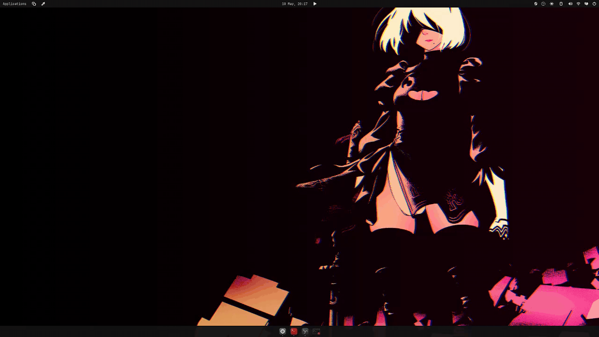

# cosmic-color-picker

A color picker for COSMIC, hacked together because nothing else worked.

`hyprpicker` does not run because `cosmic-comp` does not expose `zwlr_screencopy_v1`, and `xdg-desktop-portal-cosmic`'s `PickColor` handler is currently a `// XXX implement` stub.

v0.2 turns the original standalone picker into a proper PowerToys-style app: a background daemon, a GUI window for browsing history and configuring the shortcut, and a panel applet for one-click access. All three share the same history file.



> Will be obsolete the moment System76 implements `PickColor` properly. Treat this as a stopgap.

## What's in the box

| Binary | Job |
|---|---|
| `cosmic-color-pickerd` | Headless daemon. Owns the IPC socket, runs the overlay on demand, persists history. Auto-starts at login via the systemd user unit. |
| `cosmic-color-picker` | GUI. Hero swatch, format readouts (HEX, RGB, HSL, HSV), history strip, settings page with a click-to-record keyboard shortcut binder and an autostart toggle. |
| `cosmic-applet-color-picker` | Panel applet. Pick button + recent chip strip + "Open Color Picker..." link. |

The hotkey, the applet, and the GUI's Pick button all funnel into the same daemon, so picks land in shared history regardless of where they came from.

## Install

Pick whichever matches your distro. After install, enable the daemon once:

```sh
systemctl --user enable --now cosmic-color-pickerd
```

Add the panel applet via **COSMIC Settings → Panel → Configure panel applets → Color Picker Applet**. The GUI shows up in the launcher as "Color Picker."

### Pop!_OS / Ubuntu / Debian

Download the `.deb` from the [latest release](https://github.com/Pyxyll/cosmic-color-picker/releases/latest):

```sh
sudo apt install ./cosmic-color-picker_*.deb
```

### Fedora / openSUSE

Download the `.rpm` from the [latest release](https://github.com/Pyxyll/cosmic-color-picker/releases/latest):

```sh
sudo rpm -i cosmic-color-picker-*.rpm
```

### Arch / CachyOS / EndeavourOS / Manjaro

```sh
yay -S cosmic-color-picker          # or paru / your AUR helper of choice
```

Or build the in-tree PKGBUILD directly:

```sh
git clone https://github.com/Pyxyll/cosmic-color-picker.git
cd cosmic-color-picker/dist/aur
makepkg -si
```

### Anything else (static tarball)

Grab the `cosmic-color-picker-*-x86_64-linux.tar.gz` from the [latest release](https://github.com/Pyxyll/cosmic-color-picker/releases/latest), extract, and copy the contents into your prefix of choice (`/usr/local/`, `~/.local/`, etc.).

### Build from source

Requires `rust >= 1.95`, `just`, plus runtime tools: `grim`, `wl-clipboard`, `libnotify`.

```sh
git clone https://github.com/Pyxyll/cosmic-color-picker.git
cd cosmic-color-picker
sudo just install
systemctl --user enable --now cosmic-color-pickerd
```

`sudo just uninstall` removes everything.

## Usage

After install:

1. Open **Color Picker** from your launcher.
2. **Settings → Keyboard shortcut**: click the button, press your desired combo. Cosmic picks it up immediately. Esc cancels.
3. Hit your hotkey anywhere → magnifier overlay → click → hex copies + notification fires + the value lands in the GUI's history.
4. Or click the panel applet → big Pick button + recent chips + a link to the GUI.

## Caveats

- **Capture is a frozen screenshot via `grim`**, not live frames. Animations stop while you're picking. Same as basically every other color picker.
- **Magnifier doesn't appear until you move the mouse** after triggering. COSMIC doesn't fire `Pointer.Enter` for a fresh layer-shell surface, and seeding a default cursor position made it look broken on multi-monitor setups.
- **GUI X button kills the daemon if it was launched together.** libcosmic forces `iced::exit()` when the main window is closed (`core.exit_on_main_window_closed = true`, no public setter). The systemd user unit keeps the daemon up independently of the GUI's lifecycle, so this only matters if you started both manually.
- **Applet doesn't auto-reopen after pick.** Layer-shell popups need a recent-input-event grab serial; opening from a delayed task fails silently. Clippy-land hit the same wall.

## Architecture

```
[Hotkey]  ──spawn──>  cosmic-color-pickerd --pick ─┐
                                                    │
                                                    ├─IPC─> cosmic-color-pickerd (daemon)
                                                    │         ├── runs the overlay
[Applet]  ──spawn──>  cosmic-color-pickerd --pick ─┤         ├── persists hex to history
                                                    │         └── responds with hex
[GUI Pick] ──IPC───>  cosmic-color-pickerd (daemon)─┘
                                                    
            ~/.config/cosmic/com.pyxyll.CosmicColorPicker/v1/history (RON list)
                  ▲                       ▲                    ▲
                  │ writes                │ watch_config       │ watch_config
              daemon                    GUI                  applet
```

The daemon owns history. GUI and applet are pure clients; both subscribe to the cosmic-config history file via `watch_config`, so picks land in their UIs without explicit messaging.

## Development

```sh
cargo build --release --workspace          # all three binaries
cargo build --release -p cosmic-color-picker  # GUI only
cargo build --release -p cosmic-color-pickerd # daemon only
cargo build --release -p cosmic-applet-color-picker # applet only
```

Source structure:

```
cosmic-color-picker/
├── daemon/    cosmic-color-pickerd  (no libcosmic; pure tokio + sctk)
├── gui/       cosmic-color-picker   (libcosmic Application)
├── applet/    cosmic-applet-color-picker  (libcosmic applet)
└── dist/      systemd unit + AUR PKGBUILD
```

## License

MIT.
